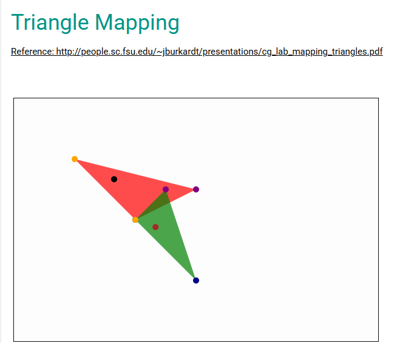

# insideout
This is an HTML/Javascript sandbox.  

## Triangle Mapping

Simple demonstration of mapping two triangles.  Click inside of the red triangle and the mapped point will appear in green triangle.

Reference: http://people.sc.fsu.edu/~jburkardt/presentations/cg_lab_mapping_triangles.pdf

 
